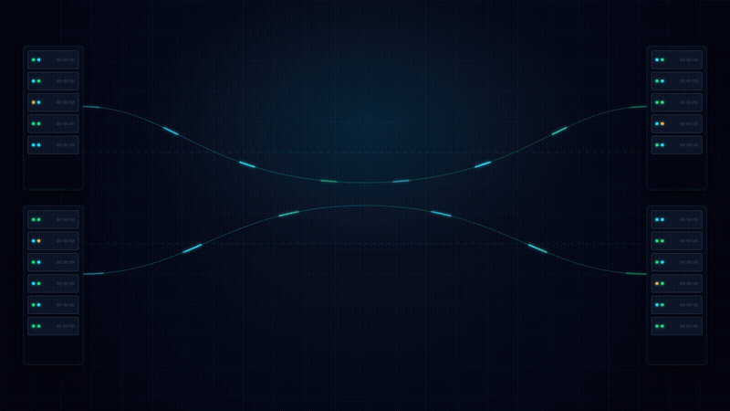

# NinjaOne Infra Dashboard & Unified Patch Toolkit ⚡

[](https://www.python.org/downloads/)
[](https://dash.plotly.com/)
[](https://opensource.org/licenses/MIT)
[](https://github.com/adchhabria/Ninjaone-Infra-Dashboard/releases)

An enterprise-grade infrastructure intelligence and operational patch management toolkit designed for **NinjaOne RMM**. Built for MSPs, IT infrastructure leaders, and compliance auditors to monitor multi-tenant device health, SLA aging backlogs, and multi-cloud hosting environments in real time.

---

## 🎬 30-Second Infrastructure Intelligence Showcase

<div align="center">

<a href="./brag.mp4" title="Click to Watch Full HD Video with Audio (brag.mp4)">
  
</a>

<p>
  <b><a href="./brag.mp4">▶️ Click Here to Watch Full HD Video with Sound (`brag.mp4`)</a></b> &nbsp;•&nbsp; 
  <b><a href="./ninjaone-architecture-showcase.html">🌐 Interactive Architecture Showcase (`HTML`)</a></b>
</p>

</div>

---

## 📐 Architecture & Telemetry Pipeline


---

## ⚡ Key Advantages & Operational Efficiency

* **⏱️ Zero Setup & Instant Portability**: Available as a single standalone executable (`Ninjaone-Infra-Dashboard.exe`). No Python installation or environment setup required.
* **🎯 Precision Patch Slicing**: Instantly isolate **OS Patches Only**, **Software Patches Only**, or evaluate **Both** simultaneously with real-time compliance recalculation.
* **⚡ Live Data Synchronization**: Direct NinjaOne REST API integration with smart TTL caching pulls thousands of devices and patch policies in seconds with zero stale-database lag.
* **📊 Dynamic SLA Thresholds**: Custom Amber/Red/Green thresholds configured in Settings automatically flow into all dashboard gauges and report exports.
* **📑 1-Click Multi-Format Export**: Generates filtered, executive-ready audits in **Interactive HTML** (with working filters & gauges), **Multi-Page Vector PDF**, and **6-Sheet Formatted Excel Workbooks**.
* **🌍 Unified Multi-Tenant Visibility**: Stacked slicers for Organizations, Locations, and OS families paired with an interactive dark-mode global infrastructure map.
* **🔄 Built-In Auto-Updater**: In-app version checks, background downloads with progress feedback, and seamless zero-lock binary restarts.

---

## 🚀 Quick Start

### Option 1: Standalone Binary (Windows)
Download the latest `Ninjaone-Infra-Dashboard.exe` from [Releases](https://github.com/adchhabria/Ninjaone-Infra-Dashboard/releases) and launch. No dependencies needed.

### Option 2: Run from Source
```bash
git clone https://github.com/adchhabria/Ninjaone-Infra-Dashboard.git
cd Ninjaone-Infra-Dashboard
python -m venv venv && .\venv\Scripts\activate
pip install -r requirements.txt

# Run in Interactive Demo Mode (No API keys required)
python src/dashboard/app.py --demo
```
Access the dashboard at **[http://localhost:8050](http://localhost:8050)**.

---

## ⚙️ NinjaOne Connection

Configure your API credentials in **⚙️ Settings** within the web UI, or set environment variables in `.env`:

```ini
NINJA_BASE_URL=https://app.ninjarmm.com  # or https://eu.ninjarmm.com
NINJA_CLIENT_ID=your_client_id
NINJA_CLIENT_SECRET=your_client_secret
```
*Required API Scopes: `monitoring`, `management`, `control` (optional for remote reboot/rescan triggers).*

---

## 🛠️ Build & Test

```bash
# Run unit test suite (55 automated tests)
python -m pytest

# Compile standalone Windows executable
python scripts/build_single_exe.py
```

---

## 📄 License

Distributed under the [MIT License](LICENSE).
